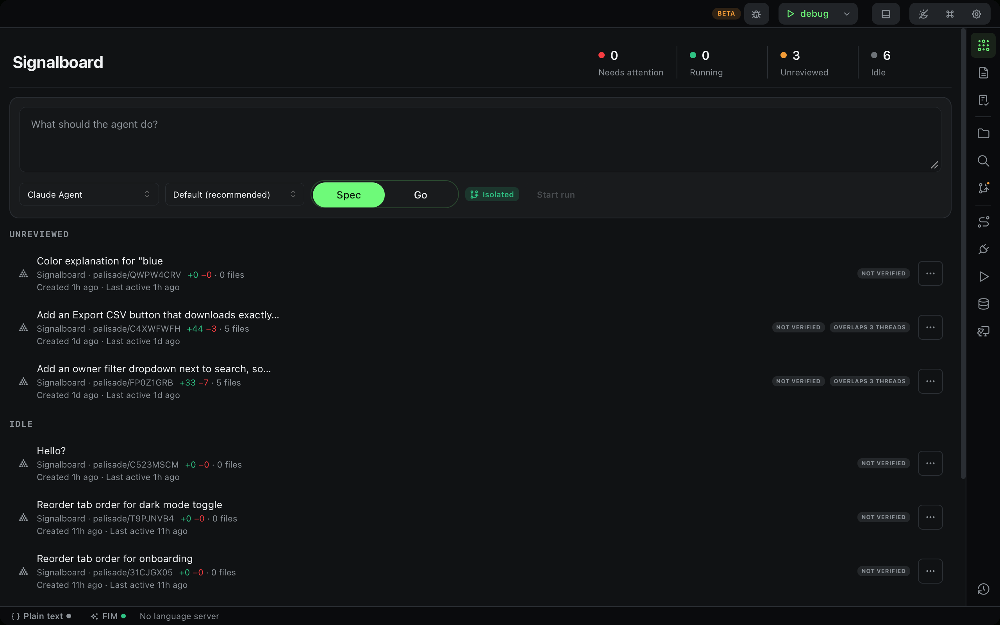
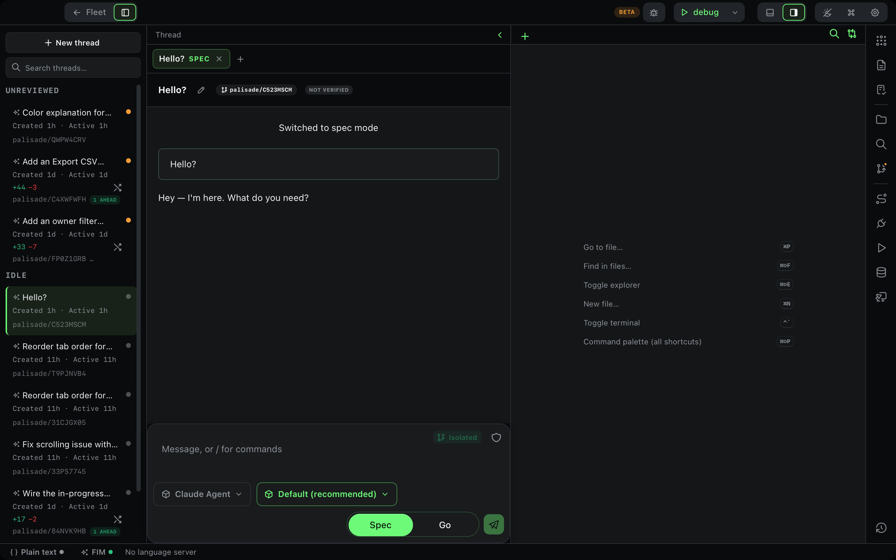
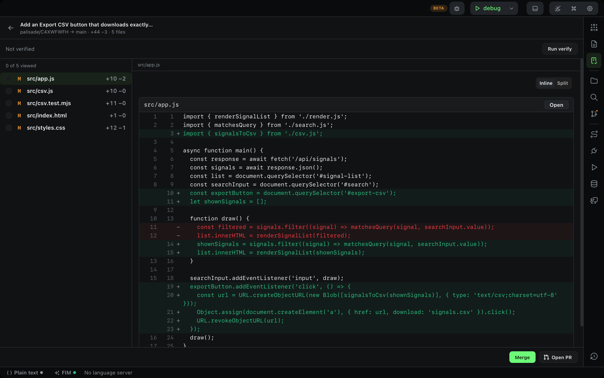
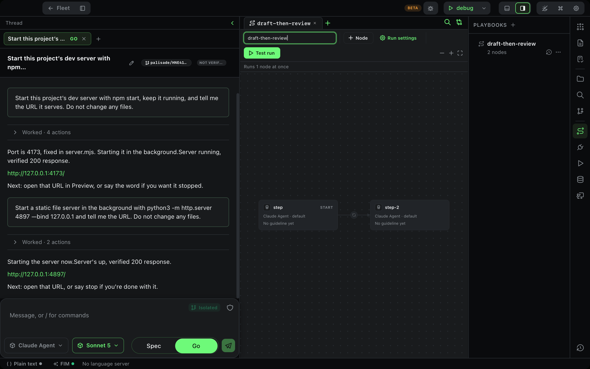

<p align="center">
  
  
</p>

<p align="center">
  <b>An Agentic Development Environment.</b><br>
  Run several coding agents in parallel, each in its own worktree. Review what they did. Merge only what verified.
</p>

<p align="center">
  <a href="https://github.com/TJLSmith0831/palisade-code/releases/latest"></a>
  <a href="LICENSE"></a>
  <a href="https://github.com/TJLSmith0831/palisade-code/actions/workflows/test.yml"></a>
  
</p>

<p align="center">
  
</p>

---

Palisade is in **public beta**. It is the tool we build Palisade with, every day, and it will have rough edges. [Issues](https://github.com/TJLSmith0831/palisade-code/issues) are read daily.

## What it does

- **Fleet board is home.** Every thread across your open projects is a row: needs attention, running, unreviewed, or idle. Agent, diff stat, verify evidence, merge readiness, and overlap with other running threads, all on one screen. A finished turn you have not opened yet badges the dock, and ⌘⇧U takes you to the next one.
- **Any ACP agent, none compiled in.** Claude Code, Codex, and whatever else the [ACP registry](https://agentclientprotocol.com/) lists and you have on `PATH`. Palisade discovers agents at runtime and speaks ACP to all of them. Pick a different agent per thread.
- **One worktree per thread.** Agents never share a working tree, so two threads can run at once on the same project without stepping on each other.

  
- **Spec, then build.** Two modes only: `spec` writes an [OpenSpec](https://github.com/Fission-AI/OpenSpec) change with the agent's permissions locked down; `go` builds it. OpenSpec stays the source of truth; Palisade never writes a spec file.
- **Verification is the only evidence.** A change is green because a named `verify` command exited 0 at a named commit. Never because a model said so. Merge stays disabled until that happens, or you override it on purpose and it says so.
- **Review lane.** Read a thread's diff file by file, with per-file viewed state and the verify evidence beside it, before you merge.

  
- **Playbooks.** Draw a graph of agent nodes with gates between them (a verify command, or your approval), save it, run it as one unit from any thread with `|=`.

  
- **The rest of an IDE.** Editor with local fill-in-the-middle completion (a bundled model, no upload), terminals, a native Preview browser per project, git, MCP server management, and a command palette.
- **Local first.** Session logs, completion telemetry and settings live under `~/.palisade-code`. Network traffic is what you would expect: your agents, your git remotes, the ACP and MCP registries, and update checks.

## Install

| Platform | Download |
|---|---|
| macOS 11+, Apple Silicon **and** Intel (one universal build) | [Latest `.dmg`](https://github.com/TJLSmith0831/palisade-code/releases/latest) |
| Windows, Linux | Not yet. Follow [the issue tracker](https://github.com/TJLSmith0831/palisade-code/issues) for progress. |

The app is signed and notarized. It updates itself; each update is checked against the project's signing key before it is installed.

You also need at least one ACP coding agent installed and logged in, for example [Claude Code](https://docs.anthropic.com/en/docs/claude-code) or [Codex](https://github.com/openai/codex). With none installed Palisade opens in chat-only mode and tells you what it is missing.

## Build from source

```bash
pnpm install
pnpm start        # tauri dev: compiles the Rust backend and opens the window
```

| Command | Purpose |
|---|---|
| `pnpm test` | All frontend tests (vitest) |
| `npx tsc --noEmit` | Typecheck |
| `cd src-tauri && cargo test` | All Rust tests |
| `pnpm build` | `tsc && vite build` |

Rust + Tauri 2 backend, React 19 + TypeScript frontend, Mantine UI. See
[CONTRIBUTING.md](CONTRIBUTING.md) for the layout, the rules the codebase
runs on, and a glossary of the words the UI uses.

## Project layout

- `src/App.tsx` — the IDE shell: panes, threads, chat, routing
- `src/api.ts` — typed wrapper over every Tauri IPC command
- `src-tauri/src/lib.rs` — IPC command layer (`generate_handler!` registry at the bottom)
- `src-tauri/src/acp_*.rs` — ACP registry, client, and event mapping
- `src-tauri/src/fleet.rs` — the Fleet board's status derivation
- `src-tauri/src/chain*.rs` — playbook definitions, runner, history
- `src-tauri/src/store.rs` — append-only session store
- `src/__tests__/*` — frontend tests, one per source file; Rust tests are inline `mod tests`

## Documentation

- [PRODUCT.md](PRODUCT.md) — what Palisade is for, and what it deliberately is not
- [DESIGN.md](DESIGN.md) — the design system every screen is built from
- [docs/adr](docs/adr) — architecture decisions
- [docs/tester-releases.md](docs/tester-releases.md) — how a release is built, signed and published
- [AGENTS.md](AGENTS.md) — packaging and per-machine codesigning for local builds

## Contributing

Read [CONTRIBUTING.md](CONTRIBUTING.md), then open an issue or a PR. Security
problems go through [SECURITY.md](SECURITY.md), never a public issue. This
project follows the [Contributor Covenant](CODE_OF_CONDUCT.md).

## License

[Apache License 2.0](LICENSE). Palisade bundles [llama.cpp](https://github.com/ggml-org/llama.cpp) (MIT) as its local completion sidecar; see [NOTICE](NOTICE).
