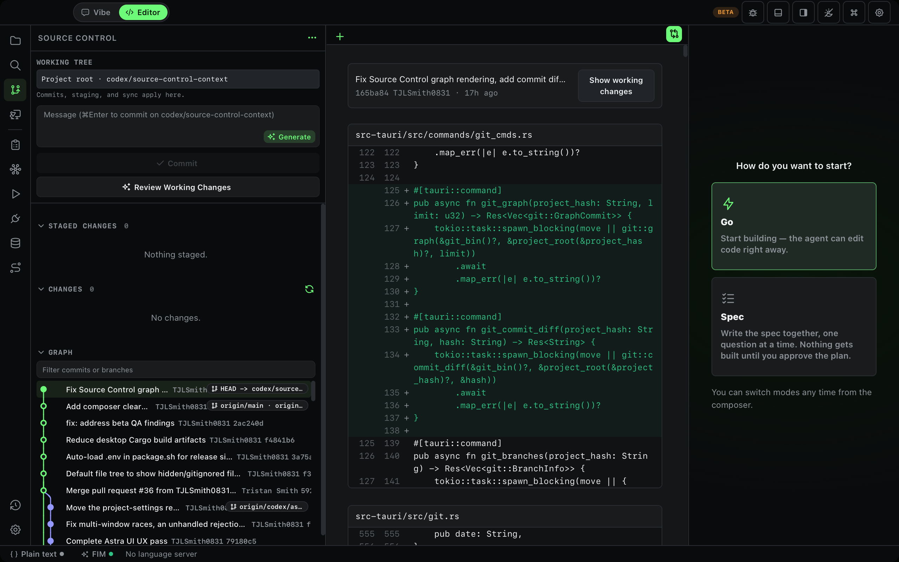
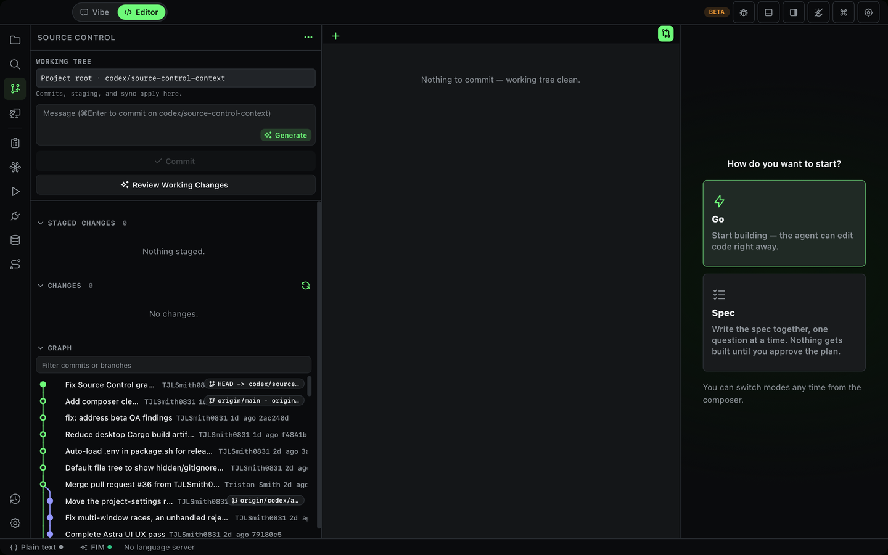

# Dogfood Report: Palisade Code — PR #37 Local Merge

| Field | Value |
|-------|-------|
| **Date** | 2026-09-09 |
| **App URL** | `tauri://localhost` (merged debug app, MCP bridge on localhost:9224) |
| **Session** | palisade-pr37-merge-20260909 |
| **Scope** | Source Control working-tree selection, commit graph, commit diffs, and uncommitted changes |

## Summary

| Severity | Count |
|----------|-------|
| Critical | 0 |
| High | 0 |
| Medium | 0 |
| Low | 1 |
| **Total** | **1** |

The issue below was fixed and re-verified in the merged desktop app after the
initial dogfood pass.

## Issues

### ISSUE-001: Commit graph omits the commit date

| Field | Value |
|-------|-------|
| **Severity** | low |
| **Category** | ux |
| **URL** | `tauri://localhost` — Source Control |
| **Repro Video** | N/A |

**Description**

Each graph row shows the subject, author, abbreviated hash, and refs, but not
the date. This makes it impossible to assess recency from the graph, despite
the graph carrying date data and presenting itself as the history overview.

**Repro Steps**

1. Open a project with commit history and select **Source Control**.
2. Inspect graph rows: none display a date or relative age.

   

## Resolution verification

### ISSUE-001 resolved: graph rows show relative commit age

- Added the existing compact relative-time treatment between author and
  abbreviated hash in each commit row.
- Reopened the Source Control graph in the locally merged Tauri app.
- The live graph displayed relative ages including `17h ago`, `1d ago`, and
  `2d ago`; no webview console errors were reported.

  

## Verified workflows

- Local, uncommitted merge of `origin/pr/37` into `origin/main` completed without conflicts.
- Source Control rendered repository refs and graph rows.
- Filtering by `origin/pr/37` narrowed the graph to the matching commit.
- Selecting two different commits replaced the commit-diff header and content.
- **Show working changes** returned to the clean-working-tree state.
- No webview console errors were reported during the exercised flows.
