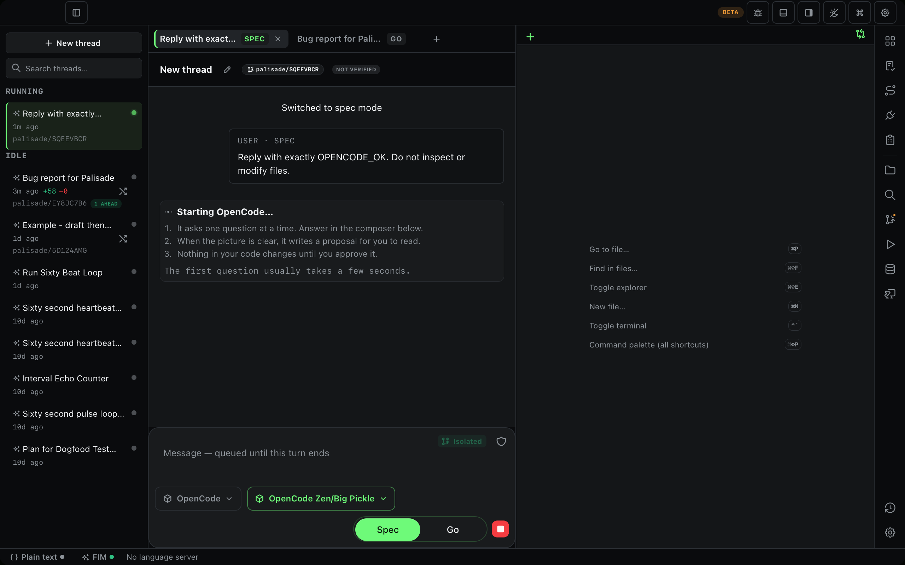

# Dogfood Report: Palisade Code PR #49

| Field | Value |
|-------|-------|
| **Date** | 2026-09-19 |
| **App URL** | Tauri dev app (`pnpm start`, bridge `127.0.0.1:9223`) |
| **Session** | pr49-20260919 |
| **Scope** | Full ADE pivot: Fleet, Review, Playbooks, Connections, Specs, Workbench, History, Settings, and representative chat flows |

## Summary

| Severity | Count |
|----------|-------|
| Critical | 0 |
| High | 0 |
| Medium | 0 |
| Low | 0 |
| **Total** | **0** |

## Issues

Issues are added here as they are reproduced. Fixed issues remain in the report with verification evidence.

### ISSUE-001: OpenCode Big Pickle stays on “Starting” indefinitely

| Field | Value |
|-------|-------|
| **Severity** | Medium |
| **Area** | Chat / executor lifecycle |
| **Status** | Environment/authentication boundary — not counted as a product defect |

**Description**

Starting a new isolated Spec run with OpenCode and the visible `OpenCode Zen/Big Pickle` model never advanced beyond the startup state. The live Agents panel reports OpenCode as needing **Sign in**, which identifies the environment's expired provider login as the boundary for this run; no external sign-in was attempted during the review.

**Reproduction**

1. Open the Fleet panel for `palisade-code`.
2. Enter `Reply with exactly OPENCODE_OK. Do not inspect or modify files.`
3. Select `OpenCode`, leave Spec mode and Isolated worktree enabled, then click **Start run**.
4. Confirm the composer displays `OpenCode Zen/Big Pickle`.
5. Observe the run's startup state while OpenCode is signed out.

**Evidence**

**Expected**

The environment needs OpenCode authentication before a real Big Pickle chat can proceed. The thread's **Stop** control returned it to an idle/retryable state without losing the recorded prompt.

## Verification notes

- Fleet: opened the board, inspected an unverified worktree, and confirmed merge is disabled until current verification passes.
- Review: opened the changed-file list and reviewed its rendered patch.
- Connections: verified the two Claude choices now render as `Sign in with Claude Subscription` and `Sign in with Anthropic Console`; a single OpenCode choice remains `Sign in`.
- Playbooks and Specs: loaded existing entries without console errors.
- Chat: Codex with GPT 5.6 Luna completed an isolated Go-mode request with `GPT_LUNA_OK`.
- OpenCode Big Pickle: selected and launched, but the provider was signed out; no login was initiated.

## Automated verification

- `pnpm exec vitest run --maxWorkers=1`: 76 files, 1,219 tests passed.
- `cargo test`: 788 passed, 1 ignored (rerun with local process/localhost access; the sandbox blocks the suite's DAP, filesystem-watch, port, and child-process tests).
- `pnpm build`: passed.
- `git diff --check`: passed.
